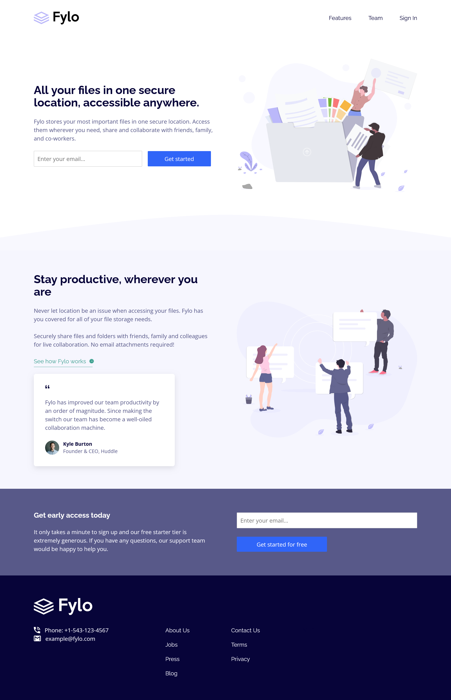

# Frontend Mentor - Fylo landing page with two column layout solution

This is a solution to the [Fylo landing page with two column layout challenge on Frontend Mentor](https://www.frontendmentor.io/challenges/fylo-landing-page-with-two-column-layout-5ca5ef041e82137ec91a50f5). Frontend Mentor challenges help you improve your coding skills by building realistic projects. 

## Table of contents

- [Overview](#overview)
  - [The challenge](#the-challenge)
  - [Screenshot](#screenshot)
  - [Links](#links)
  - [Built with](#built-with)
  - [Useful resources](#useful-resources)
- [Author](#author)

**Note: Delete this note and update the table of contents based on what sections you keep.**

## Overview

### The challenge

Users should be able to:

- View the optimal layout for the site depending on their device's screen size
- See hover states for all interactive elements on the page

### Screenshot

### Links

- Solution URL: [Fylo landing page solution](https://www.frontendmentor.io/solutions/responsive-fylo-landing-page-2-column-layout-with-css-flexbox-Ncnyswdk-b)
- Live Site URL: [Fylo landing page with two column layout](https://main--chimerical-jalebi-ccc5d9.netlify.app/)

### Built with

- Semantic HTML5 markup
- CSS custom properties
- Flexbox
- CSS Grid
- Mobile-first workflow
- BouncerJS form validator

### Useful resources

- [BouncerJS](https://github.com/cferdinandi/bouncer) - This helped with form validation without having to write any JS

## Author

- Frontend Mentor - [@Orekihotarou-k](https://www.frontendmentor.io/profile/Orekihotarou-k)
- Twitter - [@HaroukiK](https://www.twitter.com/HaroukiK)